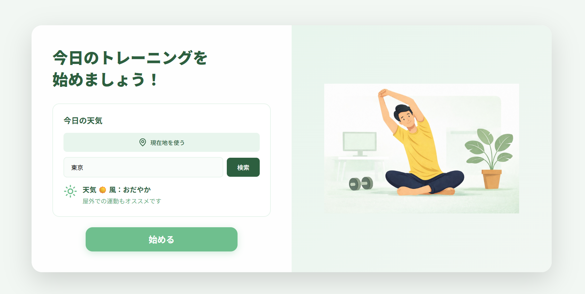
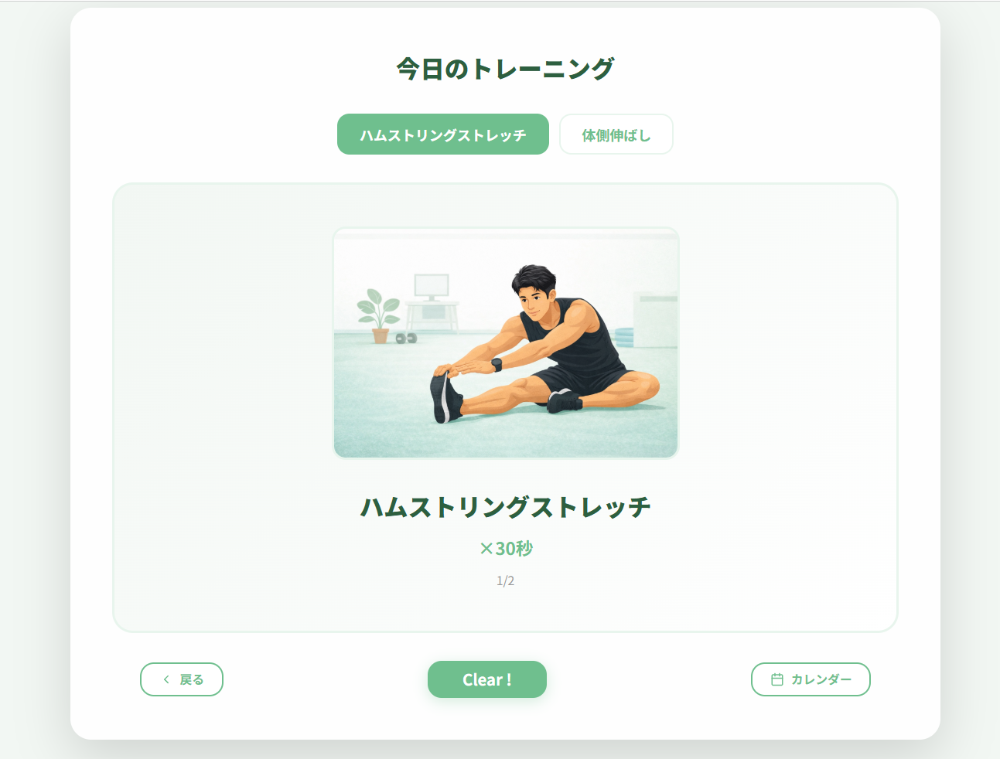
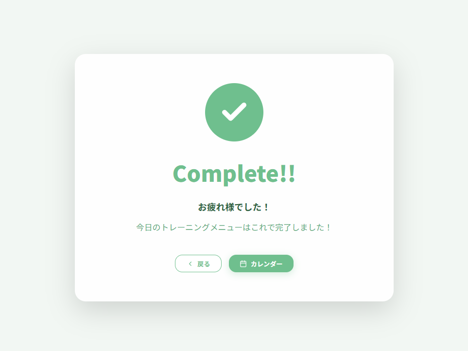
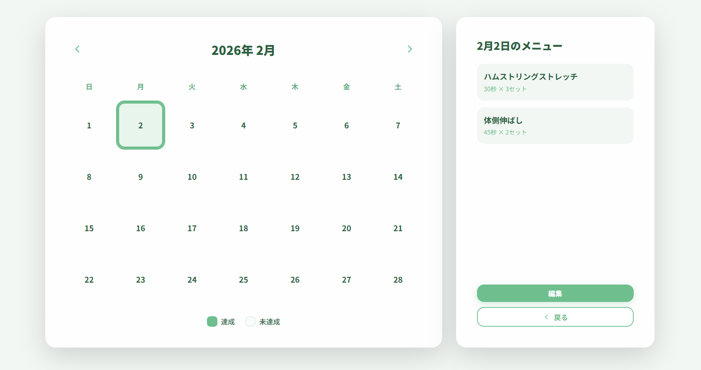
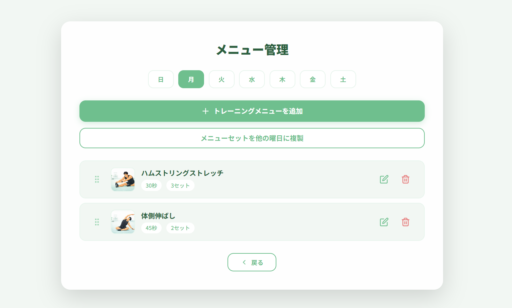
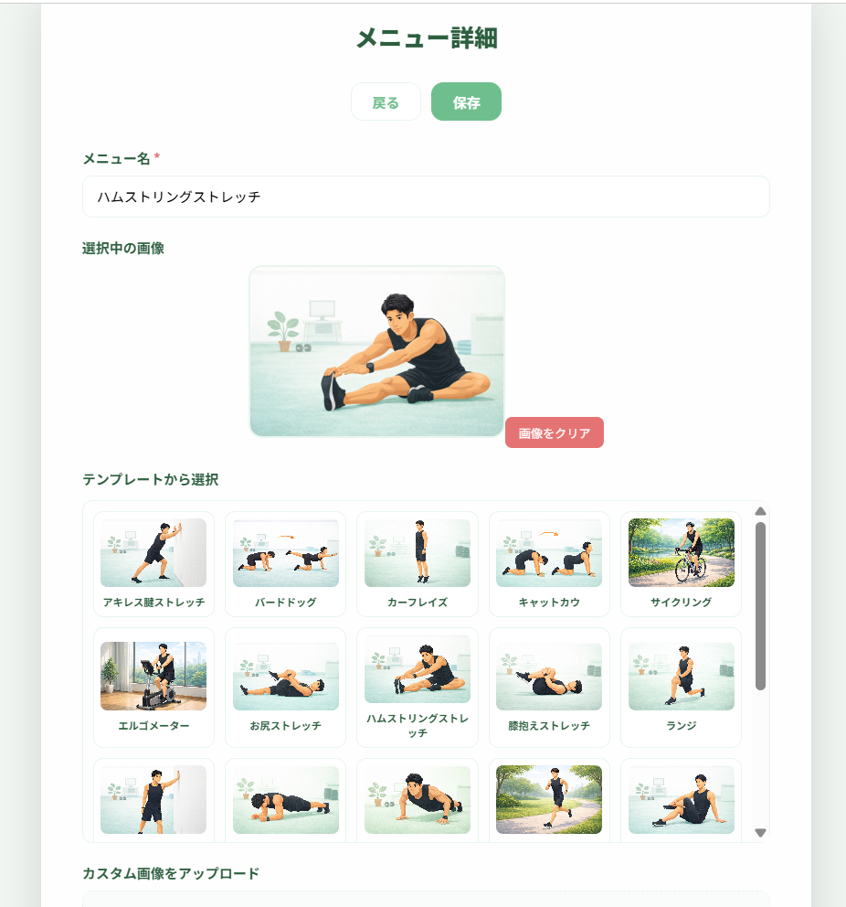

# デスクワーカーのための運動管理アプリ

長時間デスクワークで運動不足になりやすい人が、毎日の運動を無理なく継続できるようにするアプリです。自分自身がパソコンに向き合う時間が増え、腰痛を感じたことをきっかけに、同じ悩みを持つ人が多いのではないかと考え制作しました。

> **ポートフォリオとして**  
> このプロジェクトは、React / TypeScript / 外部API連携の実践経験を示すために公開しています。

## アプリの目的

- 長時間デスクワークで運動不足になりやすい人が、毎日の運動を習慣化し、健康維持ができるようサポートする。
- 曜日ごとに登録したトレーニングメニューを順番に実行でき、達成状況をカレンダーで可視化する。

## 実行画面(Vercel)

**アプリURL:** https://training-habit-app.vercel.app/

### スタート画面


### トレーニング実行画面


### 完了画面


### カレンダー画面


### メニュー管理画面


### メニュー詳細画面


## 主な機能

### 1. 天気情報連携
- WeatherAPI.comから実際の天気情報を取得
- 天気、風の状態に応じた運動推奨メッセージを表示
- 地域名検索・現在地取得に対応
- 検索した地域をlocalStorageに保存

### 2. トレーニング管理
- 曜日ごとにトレーニングメニューを設定
- あらかじめ用意されたテンプレートから選択可能
- カスタム画像のアップロード対応（ファイル選択・ドラッグ&ドロップ）
- ドラッグ&ドロップでメニューの順番変更
- 複数曜日への一括登録
- メニューセット複製機能

### 3. 達成状況の可視化
- 月間カレンダーで達成日を表示
- 日付選択でその日のメニューを確認
- localStorageでデータ永続化


## 使用技術

### フロントエンド
- **React** 18.2.0 - コンポーネント指向で再利用性の高いUI構築
- **TypeScript** 5.2.2 - 型安全性によるバグの早期発見と開発効率向上
- **Vite** 5.0.8 - 高速なHMRと軽量なビルドによる開発体験の向上

### ライブラリ
- **react-beautiful-dnd** 13.1.1 - ドラッグ&ドロップによる直感的なメニュー並び替え
- **lucide-react** 0.263.1 - 軽量で統一感のあるアイコンセット

### バックエンド
- **Vercel Serverless Functions** - 天気API用のBFF（Backend for Frontend）により、APIキーをサーバー側で安全に管理

### 開発ツール
- **ESLint** 9.39.2 - コード品質の自動チェックによる保守性向上
- **Prettier** 3.8.1 - コードスタイルの統一による可読性向上

### API
- **WeatherAPI.com** - 実際の天気情報取得により、ユーザーに適切な運動推奨を提供

### デプロイ
- **Vercel** - GitHubとの連携による自動デプロイで開発効率を向上

### その他
- **localStorage** - ブラウザ上でのデータ永続化（認証なしでも利用可能）
- **Browser Geolocation API** - 現在地の自動取得による利便性向上

## セットアップ

### 前提条件
- Node.js（v18以上推奨）
- npm または yarn

### インストール手順

1. リポジトリをクローン
```bash
git clone https://github.com/NishiwakiTaichi/training-habit-app.git
cd training-habit-app
```

2. 依存関係をインストール
```bash
npm install
```

3. 環境変数を設定

リポジトリに含まれる `.env.example` をコピーして `.env` を作成し、値を入れてください：
```bash
cp .env.example .env
```

`.env` ファイルを開き、値を入れてください：
```
VITE_WEATHER_API_KEY=あなたのWeatherAPIキー
```

> **セキュリティ注意事項**
> このアプリでは、サーバー側（Vercel Serverless Functions）でAPIキーを管理しています。
> そのため、APIキーはクライアント側には公開されません。

**APIキーの取得方法:**
- [WeatherAPI.com](https://www.weatherapi.com/signup.aspx)でアカウント作成
- ダッシュボードからAPIキーを取得
- 無料プランでは月間100万件までの利用可能

4. 開発サーバーを起動
```bash
npm run dev
```

ブラウザで `http://localhost:5173` を開く

### ビルド
```bash
npm run build
```

## プロジェクト構成
```
training-habit-app/
├── src/
│   ├── components/       # 再利用可能なUIコンポーネント
│   │   ├── Button.tsx
│   │   ├── MenuCard.tsx
│   │   └── WeatherCard.tsx
│   ├── screens/          # 各画面コンポーネント
│   │   ├── StartScreen.tsx
│   │   ├── TrainingScreen.tsx
│   │   ├── CompleteScreen.tsx
│   │   ├── CalendarScreen.tsx
│   │   ├── MenuManagementScreen.tsx
│   │   └── MenuDetailScreen.tsx
│   ├── hooks/            # カスタムフック
│   │   └── useLocalStorage.ts
│   ├── utils/            # ユーティリティ関数
│   │   ├── dateUtils.ts
│   │   └── weatherUtils.ts
│   ├── data/             # 静的データ
│   │   └── trainingData.ts
│   ├── types/            # TypeScript型定義
│   │   └── index.ts
│   ├── styles/           # スタイル
│   │   └── animations.css
│   ├── App.tsx           # メインアプリケーション
│   └── main.tsx          # エントリーポイント
├── .env                  # 環境変数（gitignore対象）
├── .gitignore
├── package.json
├── tsconfig.json
├── vite.config.ts
└── README.md
```

## 主な画面

### スタート画面
天気情報を表示し、トレーニングを開始

### トレーニング実行画面
曜日ごとのメニューを順番に実行

### 完了画面
トレーニング完了を祝福

### カレンダー画面
月間カレンダーで達成状況を可視化

### メニュー管理画面
トレーニングメニューのCRUD操作、ドラッグ&ドロップ並び替え、複製機能

### メニュー詳細画面
テンプレート選択、カスタム画像アップロード、複数曜日登録

## 開発について

### カスタムフックによるロジック共通化
`useLocalStorage`フックでlocalStorage処理を抽象化し、コードの重複を削減

### 型安全性の確保
TypeScriptで全てのコンポーネントに適切な型定義を実装

### 外部API連携
WeatherAPI.comとの非同期通信、エラーハンドリング、フォールバック処理を実装

### UXの工夫
- ローディング状態の表示
- ドラッグ&ドロップによる直感的な操作
- メニュー0件時の適切な導線設計
- 一貫性のあるデザインシステム

### データ永続化
localStorageを使用し、useEffectで確実にデータを保存

### 画像の扱い
画像はFileReaderでBase64に変換し、localStorageに保存しています。
そのため、画像の枚数や解像度が増えるとlocalStorageの5MB容量制限に達する可能性があります。
本番サービスとして運用する場合は、画像をS3やクラウドストレージに保存し、URLで管理する仕組みに移行することを検討しています。

## 今後の改善予定

- [ ] レスポンシブデザイン対応（スマホ・タブレット）
- [ ] バックエンド連携（データベース化）
- [ ] ユーザー認証機能
- [ ] 統計・グラフ機能（達成率、継続日数）
- [ ] 通知機能（リマインダー）

## 既知の問題

特記なし

## ライセンス

このプロジェクトはMITライセンスの下で公開されています。
